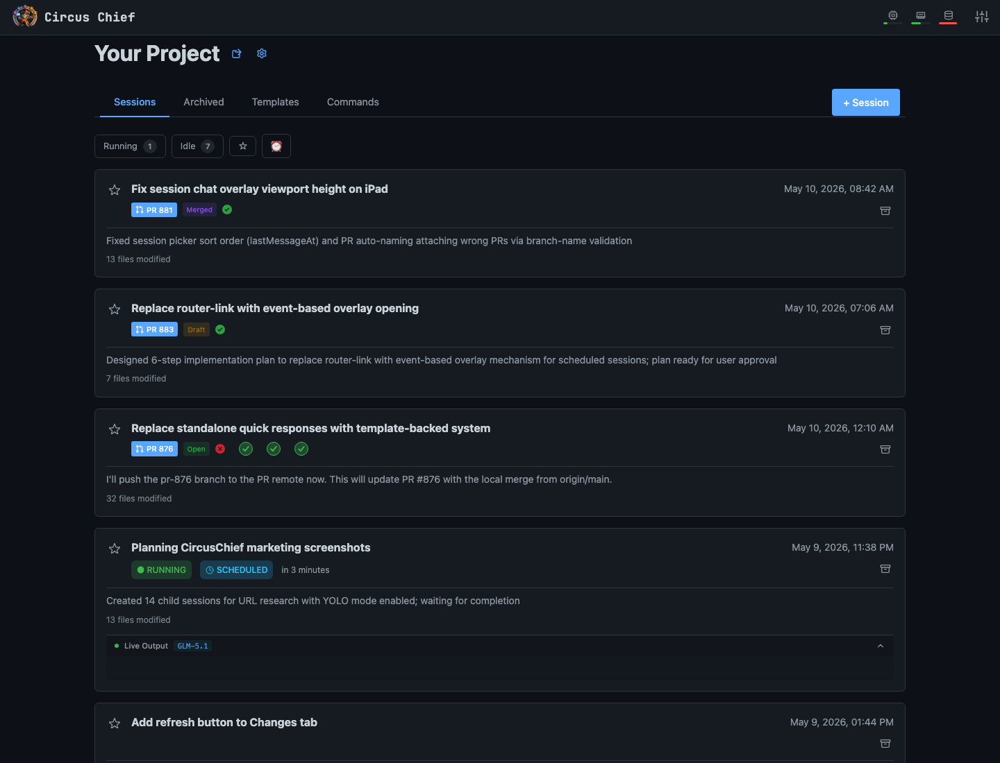
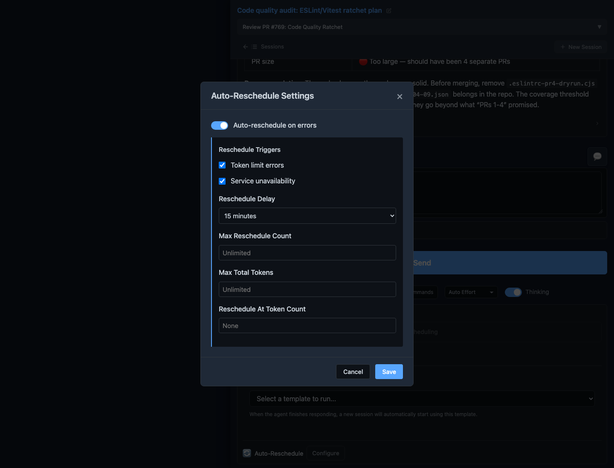
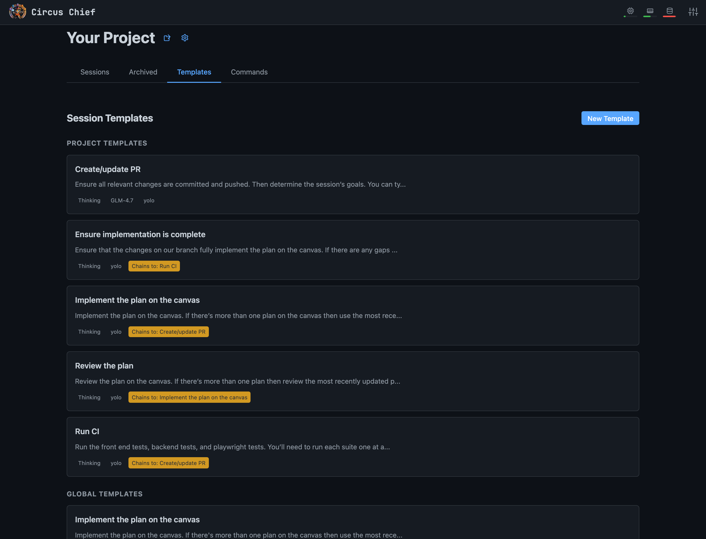
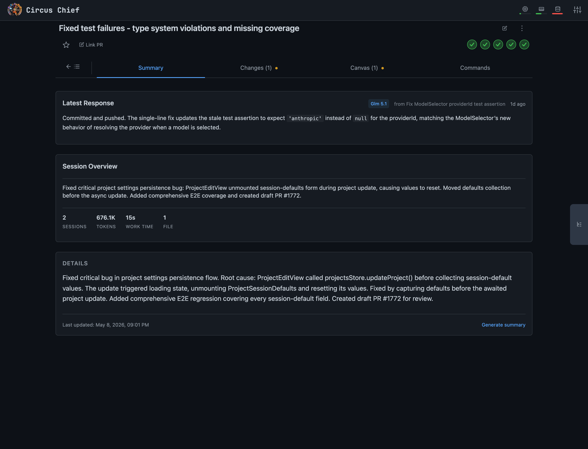
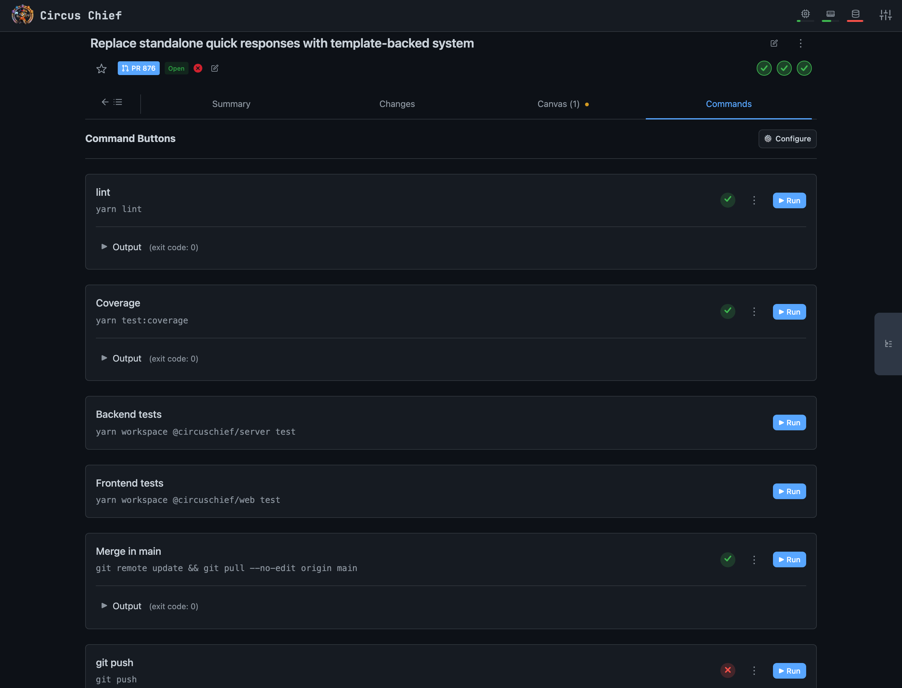
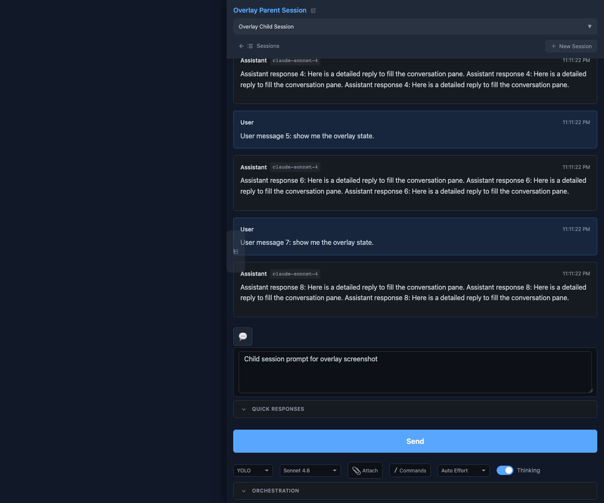
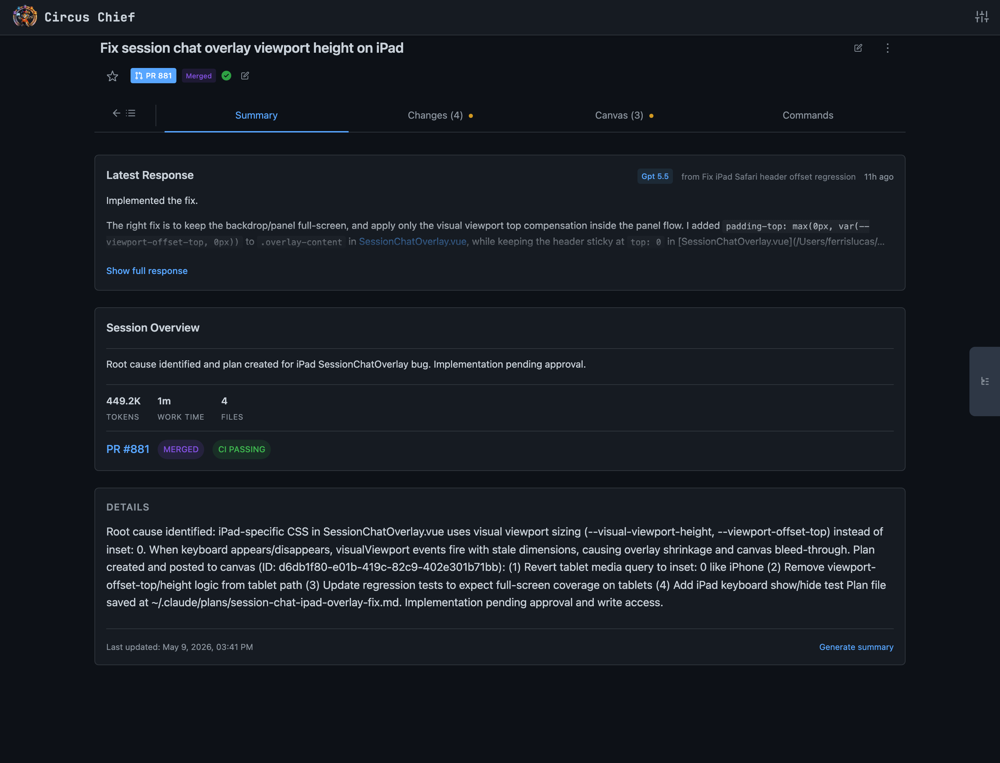
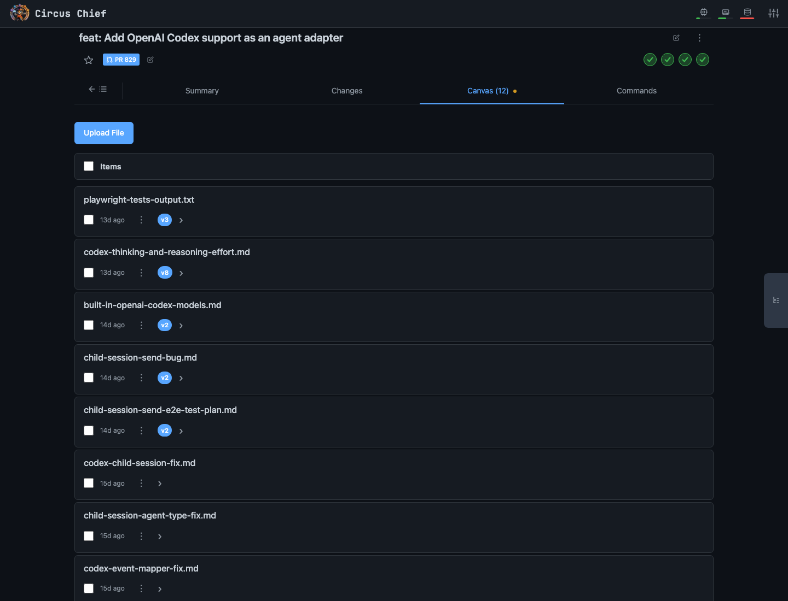
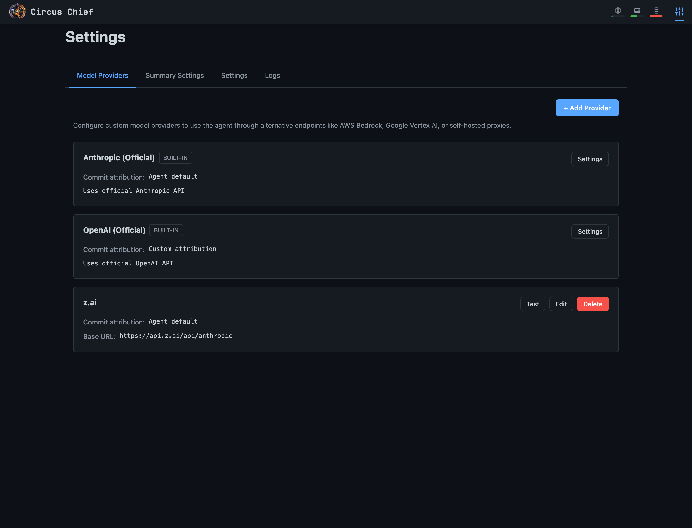
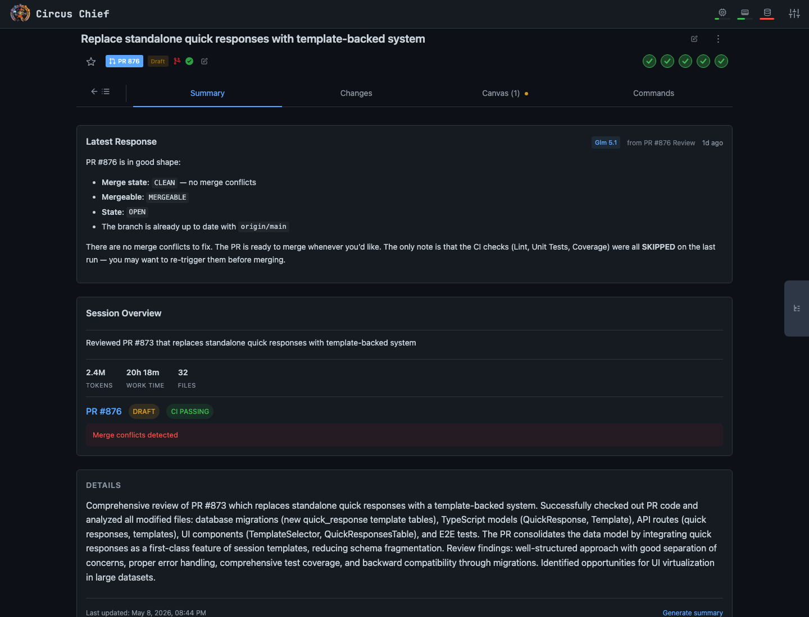

<p align="center">
  
</p>

<h1 align="center">Circus Chief</h1>

<p align="center">
  An open-source, touch-optimized control plane for managing AI coding agents.<br/><br/>
  Supports Claude Code agents (any Anthropic-compatible provider) and OpenAI Codex agents (any OpenAI-compatible provider).
  Works with API key or subscription-based authorization.
</p>

---

## Features

- **Agents can operate Circus Chief itself.** Each agent can inspect sessions, spawn follow-ups, schedule retries, stop/restart work, and react to results.
  
- **Opt-in retry on usage limits.** Toggle it on for a session and, if it hits a token cap or provider outage, it reschedules itself and picks up where it left off.
  
- **Configurable, chainable templates.** Each template defines a prompt and session settings, and one template can auto-launch the next. Example pipeline: *plan → review plan → implement the plan → review implementation → open PR* — templates can invoke themselves.
  
- **AI-generated summaries** on every session, so you can see what each agent is doing and where you left off without re-reading the whole transcript. You can turn this off in project settings.
  
- **User-configured commands.** Add one-tap buttons for the project commands you run constantly: tests, lint, build, typecheck, CI checks. Output streams live, and pass/fail results can optionally display on the dashboard.
  
- **Claude Code and Codex sessions.** Start either kind of agent from the same dashboard, with the same mobile controls, history, canvas, commands, and worktree isolation. Switch agents and/or providers freely. Invoke parallel agents against the same worktree or in their own work trees.
  
  
- **Worktree-per-session isolation.** Every session gets its own git worktree. You can also elect to work in the main git repo, or on a specific branch of the main git repo.
  
- **Shared canvas.** Markdown, images, JSON, code — agents and you edit the same artifacts. Version history included.
  
- **Bring your own provider — per session.** Use subscription auth for Anthropic or OpenAI, or point sessions at third-party providers with Anthropic- or OpenAI-compatible endpoints. Claude Code and Codex are both first-class paths.
  
- **Auto-linked GitHub PRs** with live CI and merge/conflict state (needs `gh`).
  

## How to Run

```bash
npx circuschief
```

### Options

| Flag | Description |
|------|-------------|
| `-p, --port <number>` | Port to listen on (default: `5000`) |
| `--no-analytics` | Disable anonymous usage analytics |
| `-h, --help` | Show help message |
| `-v, --version` | Show version number |

**Example — run on a custom port:**

```bash
npx circuschief -p 8080
```

## Prerequisites

- macOS or Linux
- Node.js 20+
- [Claude Code](https://docs.anthropic.com/en/docs/claude-code) — required for Claude Code agents
- [OpenAI Codex CLI](https://github.com/openai/codex) — required for Codex agents
- [GitHub CLI](https://cli.github.com/) (optional — enables automatic PR linking)

## Documentation

- [Development Guide](docs/development.md) — Quick start, commands, testing, environment variables
- [Build & Distribution](docs/build-and-distribution.md) — How the npm package is built, published, and run
- [Agent System Prompt & REST API Reference](docs/agent-system-prompt.md) — The REST API exposed to agents via the system prompt

## License and Trademarks

Circus Chief is licensed under the [Apache License 2.0](LICENSE), including
its warranty and liability disclaimers. See [NOTICE](NOTICE) for attribution
and trademark notices, and [TRADEMARKS.md](TRADEMARKS.md) for the project
trademark policy covering Circus Chief, Circus Time, and Circus Search.
